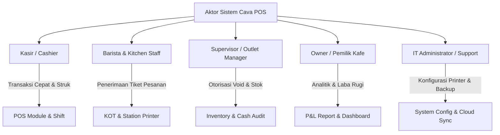
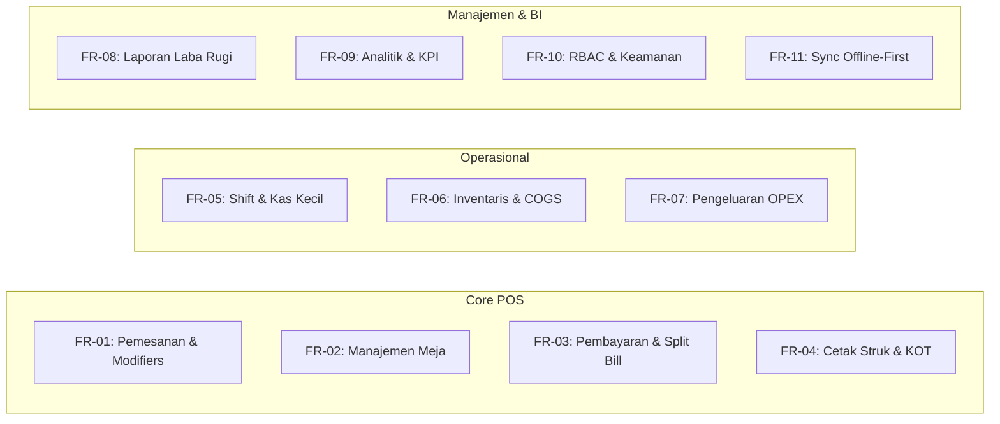
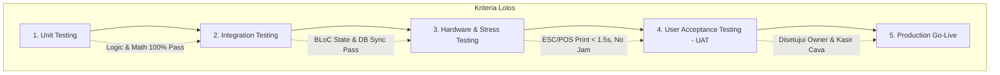

# DOKUMEN IDENTIFIKASI KEBUTUHAN DAN PERENCANAAN PROYEK TI
## Sistem Point of Sale & Manajemen Operasional Coffee Shop (Cava Cafe POS)

---

### INFORMASI DOKUMEN
| Atribut | Keterangan |
| :--- | :--- |
| **Nama Proyek** | Cava Cafe Point of Sale & Operational ERP System |
| **Kode Proyek** | PRJ-CAVA-POS-2026 |
| **Versi Dokumen** | 1.0.0 |
| **Kategori Dokumen** | Software Requirements Specification (SRS) & Project Management Plan (PMP) |
| **Tanggal Terbit** | 18 September 2026 |
| **Status** | Disetujui (Baseline) |
| **Target Pengguna** | Tim Pengembang, Project Manager, Stakeholder / Pemilik Bisnis Cava Cafe |

---

## 1. PENDAHULUAN & GAMBARAN UMUM

### 1.1 Latar Belakang
Cava Cafe merupakan unit bisnis Food & Beverage (F&B) berbasis spesialisasi kopi dan hidangan pendamping yang menghadapi peningkatan volume transaksi harian serta kompleksitas layanan pelanggan (*dine-in*, *takeaway*, variasi pesanan/kondimen khusus, serta reservasi meja). 

Sebelum adanya digitalisasi terintegrasi, operasional kafe menghadapi tantangan:
1. **Kecepatan Layanan (*Speed of Service*)**: Proses pemesanan manual di kasir memakan waktu lama, memperpanjang antrean (*queue time*) pada jam sibuk (*peak hours*).
2. **Akurasi Pesanan Dapur & Bar**: Miskomunikasi pesanan kustom (misal: tingkat gula, varian susu *oat milk*, temperatur minuman) antara kasir dan barista.
3. **Ketidakcocokan Kas & Fraud**: Risiko selisih kas pada saat pergantian shift kerja (*shift handover*) tanpa validasi saldo awal (*float cash*) dan penarikan kas tengah (*cash drop*).
4. **Pencatatan Stok Bahan Baku (COGS/HPP)**: Ketiadaan integrasi resep produk dengan kartu stok menyebabkan kebocoran bahan baku dan keterlambatan *re-stocking*.
5. **Visibilitas Keuangan Real-Time**: Owner kesulitan memantau laba bersih harian/bulanan karena data penjualan dan pengeluaran operasional (*operational expenses*) masih terpisah.

Oleh karena itu, diinisiasi proyek pengembangan **Cava Cafe POS**, sistem aplikasi Point of Sale modern berbasis *cross-platform* (Flutter & BLoC Pattern) yang dilengkapi arsitektur *offline-first*, perutean tiket pesanan termal (*ESC/POS thermal printer*), manajemen meja dinamis, dan laporan keuangan komprehensif.

### 1.2 Tujuan Proyek
* **Efisiensi Transaksi**: Memangkas waktu transaksi kasir hingga di bawah 30 detik per pesanan.
* **Otomasi Alur Pesanan**: Mengarahkan pesanan otomatis ke printer Bar dan Dapur (*Kitchen Order Ticket / KOT*) secara instan.
* **Transparansi Kas**: Mencegah selisih kas kasir melalui sistem pembukaan dan penutupan shift terverifikasi (*X/Z Report*).
* **Kontrol Finansial**: Menghasilkan Laporan Laba Rugi (*Profit & Loss Statement*) otomatis yang menghitung Pendapatan Bersih, HPP/COGS, dan Beban Operasional (*OPEX*).
* **Ketahanan Operasional**: Menjamin transaksi tetap berjalan 100% saat jaringan internet terputus dengan sinkronisasi otomatis (*offline-first*).

### 1.3 Ruang Lingkup Proyek (Scope of Work)

#### In-Scope:
* Antarmuka Kasir (*Point of Sale*) cepat dengan dukungan varian dan modifiers multi-level.
* Manajemen denah meja (*Floor Plan & Table Map*) multi-area (Indoor, Outdoor Terrace, VIP Room).
* Mekanisme pembayaran fleksibel: Tunai, QRIS Dinamis/Statis, Kartu Debit/Kredit, dan Pemisahan Tagihan (*Split Bill*).
* Perutean pencetakan struk termal ESC/POS (58mm dan 80mm) via Bluetooth, LAN/Wi-Fi, dan USB.
* Pengendalian Shift Kasir (*Open Shift*, *Cash In/Out*, *Close Shift*, *Discrepancy audit*).
* Manajemen Inventaris Bahan Baku, Kartu Stok, Peringatan Stok Menipis (*Low Stock Alert*), dan Waste.
* Pencatatan Pengeluaran Kas Kecil (*Petty Cash*) dan operasional kafe harian.
* Laporan Keuangan Komprehensif (Laba Rugi, Penjualan per Kategori, Ekspor PDF & CSV).
* Dashboard Analisis Performa Bisnis khusus Owner (Grafik Penjualan, Heatmap Jam Sibuk, Best Sellers).
* Sistem Keamanan Multi-Peran (*Role-Based Access Control / RBAC*) dengan otorisasi PIN.

#### Out-of-Scope:
* Integrasi langsung dengan API bank core banking otomatis untuk *auto-settlement* kartu kredit (menggunakan terminal EDC fisik eksternal).
* Sistem pemesanan mandiri oleh pelanggan melalui aplikasi mobile konsumen (*Customer Self-Ordering App* dialokasikan untuk Fase 2).
* Modul penggajian karyawan (*Payroll system* kompleks).

---

## 2. STAKEHOLDER & ANALISIS PENGGUNA

### 2.1 Identifikasi Aktor & Peran (User Roles)



1. **Kasir (Cashier)**:
   * Menangani antrean pemesanan, memilih produk, menerapkan varian/catatan pelanggan.
   * Mengatur nomor meja (*dine-in*) atau jenis layanan *takeaway*.
   * Melakukan transaksi pembayaran, menghitung uang kembalian, membagi tagihan (*split bill*), dan mencetak struk.
   * Melakukan *Open Shift* (input kas awal) dan *Close Shift* (rekonsiliasi uang fisik).
2. **Barista & Kitchen Staff**:
   * Menerima tiket pesanan dapur/bar yang tercetak otomatis dengan instruksi varian/kustomisasi yang jelas.
3. **Supervisor / Outlet Manager**:
   * Memberikan otorisasi (*PIN validation*) untuk tindakan sensitif: Pembatalan pesanan (*Void*), diskon khusus manual, dan pengembalian dana (*Refund*).
   * Melakukan audit stok fisik (*stock opname*) dan penyesuaian inventaris (*inventory adjustment*).
   * Menyetujui pengeluaran kas kecil operasional.
4. **Owner (Pemilik Usaha)**:
   * Memantau performa penjualan, margin kotor, dan laba bersih secara berkala.
   * Mengakses dashboard analitik penjualan, jam sibuk, tren produk terlaris.
   * Mengunduh dokumen laporan keuangan resmi (format PDF dan CSV/Excel).
5. **IT Administrator / Support**:
   * Melakukan konfigurasi perangkat keras (printer termal, cash drawer, jaringan LAN/Wi-Fi).
   * Mengawasi status sinkronisasi antrean *offline-to-cloud* dan pemeliharaan basis data lokal.

### 2.2 Matriks RACI (Responsible, Accountable, Consulted, Informed)

| Aktivitas / Fitur | Kasir | Supervisor | Owner | Barista/Kitchen | IT Support |
| :--- | :---: | :---: | :---: | :---: | :---: |
| Transaksi Penjualan & Cetak Struk | **R** | A | I | I | C |
| Buka / Tutup Shift & Hitung Kas | **R** | **A** | I | - | - |
| Void Transaksi / Diskon Khusus | C | **R / A** | I | I | - |
| Pembaruan Stok & Resep | I | **R** | A | C | - |
| Input Pengeluaran Kas Harian | R | **R / A** | I | - | - |
| Analisis Laba Rugi & Performa | - | C | **R / A** | - | - |
| Setup Hardware & Konfigurasi Sync | - | C | I | - | **R / A** |

*(Keterangan: R = Responsible, A = Accountable, C = Consulted, I = Informed)*

---

## 3. IDENTIFIKASI KEBUTUHAN SISTEM

### 3.1 Kebutuhan Fungsional (Functional Requirements - FR)



#### Modul 1: Pemesanan & Katalog Produk (POS Core)
* **FR-01.1**: Sistem harus menampilkan katalog produk dengan kategori terstruktur (Coffee, Non-Coffee, Food, Pastry, Add-ons).
* **FR-01.2**: Sistem harus mendukung varian produk (misal: Regular, Large, Hot, Iced) dengan penyesuaian harga dinamis.
* **FR-01.3**: Sistem harus menyediakan *Modifier Groups* multi-pilihan (misal: Tingkat Gula, Jenis Susu: Oat/Almond, Extra Espresso Shot).
* **FR-01.4**: Sistem harus menyediakan kolom catatan khusus (*custom order note*) per item produk untuk instruksi alergi/preferensi pelanggan.
* **FR-01.5**: Sistem harus mendukung pencarian produk cepat berbasis teks (*real-time filter*).

#### Modul 2: Denah Meja & Manajemen Layanan (Table & Floor Plan)
* **FR-02.1**: Sistem harus menyediakan visualisasi denah meja (*Floor Plan*) berdasarkan area: *Indoor, Outdoor Terrace, VIP Room*.
* **FR-02.2**: Sistem harus memperbarui status meja secara real-time:
  * **Kosong (Vacant)**: Meja siap digunakan.
  * **Terisi (Occupied)**: Sedang digunakan dengan pesanan aktif.
  * **Reserved**: Telah dipesan sebelumnya.
  * **Billing**: Pelanggan telah meminta tagihan pembayaran.
* **FR-02.3**: Sistem harus memungkinkan pemilihan meja secara langsung dari denah yang otomatis terhubung ke keranjang transaksi (*cart*).
* **FR-02.4**: Sistem harus mendukung jenis pesanan *Dine-in* (dengan nomor meja) dan *Takeaway / Drive-thru*.

#### Modul 3: Checkout, Multi-Payment, & Split Bill
* **FR-03.1**: Sistem harus menghitung total tagihan dengan rincian subtotal, diskon (nominal/persentase), pajak (PPN/PB1), dan biaya layanan (*service charge*).
* **FR-03.2**: Sistem harus mendukung opsi pemisahan tagihan (*Split Bill*) berdasarkan nominal merata atau per item pesanan.
* **FR-03.3**: Sistem harus mendukung metode pembayaran: Tunai (*Cash*) dengan kalkulator uang kembalian otomatis, QRIS (Statis/Dinamis), Kartu Debit, dan Kartu Kredit.
* **FR-03.4**: Sistem harus menerbitkan nomor struk/antrean unik berbasis UUID / penomoran sekuensial harian (contoh: `#ORD-20260918-001`).

#### Modul 4: Integrasi Perangkat Keras & Thermal Printing (ESC/POS)
* **FR-04.1**: Sistem harus terhubung dengan printer termal standar ESC/POS lebar kertas 58mm dan 80mm (koneksi Bluetooth, Jaringan LAN/TCP-IP, dan USB).
* **FR-04.2**: Sistem harus mencetak struk transaksi pelanggan dengan format rapi (Logo kafe, detail item, modifier, pajak, info pembayaran, ucapan terima kasih).
* **FR-04.3**: Sistem harus mendukung pencetakan tiket pesanan dapur/bar (*Kitchen Order Ticket / KOT*) yang mengelompokkan item minuman ke Bar dan makanan ke Dapur.
* **FR-04.4**: Sistem harus dapat mengirimkan sinyal pembuka laci kasir (*Cash Drawer trigger via RJ11*) secara otomatis saat transaksi tunai selesai dicetak.

#### Modul 5: Manajemen Shift & Kasir (Cash Management)
* **FR-05.1**: Sistem mewajibkan kasir melakukan *Open Shift* dengan mencatat saldo awal laci (*float cash*).
* **FR-05.2**: Sistem mencatat riwayat penambahan kas masuk (*cash in*) atau penarikan kas tengah (*cash drop*) selama jam operasional.
* **FR-05.3**: Sistem mewajibkan proses *Close Shift* dengan input saldo akhir fisik, membandingkan secara otomatis terhadap total sistem, dan menghitung selisih (*cash discrepancy*).
* **FR-05.4**: Sistem mampu mencetak ringkasan laporan shift (Laporan X untuk pertengahan shift, Laporan Z untuk akhir shift).

#### Modul 6: Manajemen Inventaris & Resep (Inventory & Recipe)
* **FR-06.1**: Sistem harus mencatat daftar bahan baku (*raw materials*) beserta satuan unit (gram, ml, pcs, pack).
* **FR-06.2**: Sistem harus mendukung hubungan resep (*Bill of Materials / BOM*), di mana setiap penjualan menu kopi otomatis memotong stok biji kopi, susu, sirup, dan kemasan.
* **FR-06.3**: Sistem harus memberikan indikator peringatan stok menipis (*Low Stock Alert*) jika kuantitas berada di bawah batas minimum (*threshold*).
* **FR-06.4**: Sistem menyediakan pencatatan penyesuaian stok (*Stock Adjustment*), barang masuk (*Purchase In*), dan bahan terbuang/kedaluwarsa (*Waste/Spoilage*).

#### Modul 7: Beban Pengeluaran Operasional (Operational Expenses)
* **FR-07.1**: Sistem harus menyediakan formulir pencatatan pengeluaran kas kecil (*Petty Cash*) seperti pembelian es batu, gas, biaya listrik, atau perlengkapan kebersihan.
* **FR-07.2**: Sistem harus menyediakan template pengeluaran berulang (*recurring expense templates*) untuk kemudahan input kasir/supervisor.

#### Modul 8: Laporan Keuangan & Laba Rugi (Financial Reports & P&L)
* **FR-08.1**: Sistem harus mengkalkulasi Laporan Laba Rugi (*Profit and Loss Statement*) secara real-time:
  $$\text{Laba Bersih} = \text{Pendapatan Bersih} - \text{HPP (COGS)} - \text{Total Beban Operasional (OPEX)}$$
* **FR-08.2**: Sistem menyediakan penyaringan laporan berdasarkan rentang waktu: Hari Ini, Kemarin, 7 Hari Terakhir, Bulan Ini, dan Kustom.
* **FR-08.3**: Sistem mampu mengekspor laporan keuangan ke dalam format dokumen PDF berstandar cetak dan file CSV/Excel untuk pengolahan lebih lanjut.

#### Modul 9: Dashboard Analitik Bisnis (Owner BI Dashboard)
* **FR-09.1**: Sistem harus menampilkan ringkasan metrik utama: Total Penjualan, Total Transaksi, Rata-Rata Belanja (*Average Basket Size*), dan Produk Terlaris.
* **FR-09.2**: Sistem harus memvisualisasikan grafik tren penjualan harian/mingguan.
* **FR-09.3**: Sistem harus menampilkan grafik jam sibuk (*Peak Hours Heatmap*) untuk optimasi jadwal kerja staf kafe.

#### Modul 10: Keamanan & Role-Based Access Control (RBAC)
* **FR-10.1**: Sistem membatasi fitur berdasarkan peran akun pengguna (Kasir, Supervisor, Owner).
* **FR-10.2**: Sistem memproteksi modul Laporan Keuangan dan Dashboard Analitik hanya dapat diakses oleh akun dengan peran Owner.
* **FR-10.3**: Fitur pembatalan transaksi (*Void Order*) dan diskon manual harus meminta validasi PIN otorisasi Supervisor/Owner.
* **FR-10.4**: Sistem harus mencatat jejak audit (*audit trail*) untuk setiap tindakan penghapusan atau revisi data finansial.

#### Modul 11: Sinkronisasi & Arsitektur Offline-First
* **FR-11.1**: Seluruh fungsi kasir dan pencatatan lokal harus tetap beroperasi penuh saat koneksi internet terputus (*Offline Mode*).
* **FR-11.2**: Sistem menyimpan transaksi lokal ke dalam antrean sinkronisasi (*Sync Queue*).
* **FR-11.3**: Ketika koneksi internet pulih, sistem secara otomatis mengeksekusi sinkronisasi latar belakang (*background sync*) dengan penyelesaian konflik data (*conflict resolution*).

---

### 3.2 Kebutuhan Non-Fungsional (Non-Functional Requirements - NFR)

Menggunakan kerangka standar **FURPS+** (*Functionality, Usability, Reliability, Performance, Supportability*):

| Kategori | Kode | Spesifikasi Kebutuhan Non-Fungsional | Tolok Ukur / Metrik |
| :--- | :--- | :--- | :--- |
| **Performance** | NFR-P1 | Waktu respon antarmuka pengguna pada penambahan item ke keranjang | $\le 100 \text{ ms}$ |
| | NFR-P2 | Waktu penyelesaian proses transaksi hingga perintah cetak terkirim | $\le 1.5 \text{ detik}$ |
| | NFR-P3 | Waktu *cold start* aplikasi hingga layar kasir siap digunakan | $\le 2.5 \text{ detik}$ pada perangkat target |
| **Usability** | NFR-U1 | Desain antarmuka ramah layar sentuh (*touchscreen-friendly*) dengan ukuran tombol minimal $48 \times 48 \text{ dp}$ | 100% kepatuhan Material Design Guidelines |
| | NFR-U2 | Mendukung mode tampilan Gelap (*Dark Mode*) dan Terang (*Light Mode*) dengan kontras warna memadai | Standar aksesibilitas WCAG AA |
| | NFR-U3 | Kecepatan pelatihan staf baru hingga mahir mengoperasikan POS | $\le 30 \text{ menit}$ pelatihan |
| **Reliability** | NFR-R1 | Tingkat ketersediaan aplikasi kasir (*system availability*) | 99.9% uptime operasional |
| | NFR-R2 | Ketahanan saat listrik/jaringan mati mendadak | Data keranjang & transaksi tidak boleh korup (*ACID compliance lokal*) |
| **Security** | NFR-S1 | Penyimpanan PIN Supervisor/Owner | Enkripsi *one-way hash* (SHA-256 + Salt) |
| | NFR-S2 | Akses data sensitif laporan laba rugi | Proteksi *Barrier Gate* & Session Timeout |
| **Supportability** | NFR-SP1 | Kompatibilitas Multi-Platform | Berjalan di Windows (Desktop POS), Android (Tablet/Mobile POS), iOS, Web |
| | NFR-SP2 | Kemudahan pemeliharaan kode (*maintainability*) | Arsitektur Modular, State Management terstandar BLoC |

---

## 4. ARSITEKTUR TEKNIS & SPESIFIKASI PERANGKAT

### 4.1 Arsitektur Perangkat Lunak (Software Architecture)

Aplikasi Cava Cafe POS dibangun menggunakan pendekatan **Clean Architecture** yang dipadukan dengan **BLoC (Business Logic Component)** pattern pada framework Flutter:

```
┌─────────────────────────────────────────────────────────────┐
│                   PRESENTATION LAYER                        │
│   Flutter Widgets, Pages (PosMainScreen, TableMapScreen)   │
│         State Management: Flutter BLoC & Events             │
└──────────────────────────────┬──────────────────────────────┘
                               │
                               ▼
┌─────────────────────────────────────────────────────────────┐
│                      DOMAIN LAYER                           │
│     Entities (Order, Product, CafeTable, ExpenseItem)       │
│     Business Rules, User Roles & Authorization Logic        │
└──────────────────────────────┬──────────────────────────────┘
                               │
                               ▼
┌─────────────────────────────────────────────────────────────┐
│                       DATA LAYER                            │
│  Data Sources: Local DB (Queue/Cache), ESC/POS Printer API  │
│          Cloud Sync Service & Conflict Resolution           │
└─────────────────────────────────────────────────────────────┘
```

### 4.2 Spesifikasi Kebutuhan Perangkat Keras (Hardware Requirements)

| Perangkat | Spesifikasi Minimum | Rekomendasi Ideal |
| :--- | :--- | :--- |
| **Kasir Terminal (Utama)** | Windows 10/11 x64 / Android Tablet 10", RAM 4 GB, Storage 64 GB SSD | Touchscreen POS Terminal 15.6" Full HD, Core i3 / Snapdragon 680+, RAM 8 GB |
| **Thermal Receipt Printer** | 58mm Thermal Printer (Bluetooth / USB) | 80mm Thermal Printer Auto-Cutter (Ethernet LAN + USB, High Speed $\ge 200\text{mm/s}$) |
| **Kitchen / Bar Printer** | 80mm Impact / Thermal Printer via LAN | 80mm Thermal Printer with Audio Buzzer (Alarm Dapur) via LAN |
| **Cash Drawer (Laci Uang)** | Standard 4 Bill / 5 Coin dengan kabel RJ-11 terhubung ke printer struk | Heavy-duty Metal Cash Drawer RJ-11 dengan sensor pembuka otomatis |
| **Barcode / QRIS Scanner** | 1D/2D Barcode Scanner via USB | Wireless 2D Handheld QR/Barcode Scanner |
| **Jaringan Lokal (LAN/Wi-Fi)**| Router Wi-Fi 2.4 GHz standar | Dual-Band Wi-Fi 6 Router (2.4 GHz + 5 GHz) dengan Dedicated SSID Kasir |

---

## 5. PERENCANAAN PROYEK TI (PROJECT MANAGEMENT PLAN)

### 5.1 Metodologi Proyek: Agile Scrum
Proyek dikelola menggunakan metode **Agile Scrum** dengan siklus *Sprint* 2 mingguan (14 hari per Sprint) untuk mengakomodasi umpan balik yang cepat dari manajemen kafe dan kasir lapangan.

```mermaid
gantt
    title Roadmap Pengembangan Cava Cafe POS
    dateFormat  YYYY-MM-DD
    section Inisiasi & Desain
    Analisis Kebutuhan & SRS        :done,    des1, 2026-08-01, 2026-08-10
    UI/UX Design & Wireframing      :done,    des2, 2026-08-11, 2026-08-20
    section Sprint Pengembangan
    Sprint 1: Core POS & Katalog    :done,    sp1, 2026-08-21, 2026-09-03
    Sprint 2: Meja & ESC/POS Print  :done,    sp2, 2026-09-04, 2026-09-17
    Sprint 3: Shift & Inventaris    :active,  sp3, 2026-09-18, 2026-10-01
    Sprint 4: OPEX & Laporan P&L    :         sp4, 2026-10-02, 2026-10-15
    Sprint 5: Owner BI & OfflineSync:         sp5, 2026-10-16, 2026-10-29
    section QA & Peluncuran
    UAT & Uji Stabilitas Hardware   :         qa1, 2026-10-30, 2026-11-08
    Training Karyawan & Go-Live     :         qa2, 2026-11-09, 2026-11-15
```

### 5.2 Work Breakdown Structure (WBS)

```
1.0 Proyek Cava Cafe POS
   ├── 1.1 Inisiasi & Analisis Kebutuhan
   │   ├── 1.1.1 Observasi Alur Kasir & Barista Cava Cafe
   │   ├── 1.1.2 Penyusunan Dokumen SRS & Identifikasi Kebutuhan
   │   └── 1.1.3 Penetapan Arsitektur Teknologi (Flutter, BLoC, ESC/POS)
   ├── 1.2 Desain Antarmuka (UI/UX)
   │   ├── 1.2.1 Design System (AppColors, Typography, Theme Dark/Light)
   │   ├── 1.2.2 Wireframe & Mockup Layar Kasir, Denah Meja, & Modal Pembayaran
   │   └── 1.2.3 Desain Format Cetak Struk 58mm & 80mm
   ├── 1.3 Pengembangan Perangkat Lunak (Development)
   │   ├── 1.3.1 Modul POS & Keranjang Belanja (Cart BLoC, Menu BLoC)
   │   ├── 1.3.2 Modul Manajemen Meja & Status Okupansi
   │   ├── 1.3.3 Layanan Printer Termal (ESC/POS Service & Receipt Generator)
   │   ├── 1.3.4 Modul Shift & Pengendalian Kas (Float Cash & X/Z Report)
   │   ├── 1.3.5 Modul Inventaris Bahan Baku, Resep, & Waste Management
   │   ├── 1.3.6 Modul Pengeluaran Operasional & Kas Kecil
   │   ├── 1.3.7 Modul Laporan Keuangan (Laba Rugi, Ekspor PDF & CSV)
   │   ├── 1.3.8 Modul Dashboard Analitik Owner (Sales Chart, Heatmap)
   │   └── 1.3.9 Modul Keamanan RBAC & Cloud Sync Offline-First
   ├── 1.4 Pengujian Kualitas (Testing & QA)
   │   ├── 1.4.1 Unit Testing Logika Bisnis (Diskon, Perhitungan Pajak, HPP)
   │   ├── 1.4.2 Hardware Compatibility Testing (Pengujian ragam printer & drawer)
   │   ├── 1.4.3 Network Interruption Test (Uji simulasi internet putus-nyambung)
   │   └── 1.4.4 User Acceptance Testing (UAT) bersama Tim Kasir & Manager
   └── 1.5 Implementasi & Pemeliharaan (Deployment)
       ├── 1.5.1 Instalasi Terminal Kasir & Perangkat Keras di Outlet Cava Cafe
       ├── 1.5.2 Pelatihan Kasir, Supervisor, & Owner
       ├── 1.5.3 Fase Pendampingan Operasional Awal (Hypercare 14 Hari)
       └── 1.5.4 Dokumentasi Manual Pengguna & SOP Sistem
```

### 5.3 Rencana Sumber Daya & Struktur Tim

| Peran Tim | Tanggung Jawab Utama | Alokasi |
| :--- | :--- | :--- |
| **Project Manager / Scrum Master** | Mengelola jadwal, memitigasi kendala (*blockers*), memfasilitasi komunikasi tim & stakeholder. | 1 Orang |
| **Lead Flutter Developer** | Merancang arsitektur aplikasi, integrasi driver ESC/POS, manajemen state BLoC, & offline-sync. | 1 Orang |
| **Frontend/Mobile Developer** | Mengembangkan komponen UI responsif, interaksi meja, modal transaksi, animasi visual. | 1 Orang |
| **Backend & Cloud Engineer** | Menyiapkan API sinkronisasi, database cloud, autentikasi cloud, dan layanan agregasi analitik. | 1 Orang |
| **UI/UX Designer** | Mendesain antarmuka ramah sentuhan, alur kerja pemesanan efisien, serta materi panduan visual. | 1 Orang |
| **QA Engineer / Hardware Tester**| Menulis skenario uji fungsional, menguji ketahanan koneksi hardware printer, dan load testing. | 1 Orang |
| **Product Owner (Perwakilan Cava)**| Menentukan prioritas fitur, memverifikasi kesesuaian SOP F&B, dan memberikan persetujuan UAT. | 1 Orang |

### 5.4 Rencana Manajemen Risiko (Risk Management Plan)

| ID | Deskripsi Risiko | Dampak | Probabilitas | Rencana Mitigasi |
| :---: | :--- | :---: | :---: | :--- |
| **R-01** | Koneksi internet di kafe mati mendadak saat antrean panjang. | **Tinggi** | **Tinggi** | Terapkan arsitektur *Offline-First* penuh. Data disimpan ke local storage dan sinkronisasi otomatis dijalankan begitu internet aktif kembali. |
| **R-02** | Kertas struk printer macet (*paper jam*) atau koneksi Bluetooth putus. | Sedang | Sedang | Sediakan tombol *Reprint Last Receipt* instan, auto-reconnect Bluetooth di latar belakang, dan notifikasi visual di layar kasir. |
| **R-03** | Human error: Kasir keliru menginput pembayaran atau salah klik menu. | Sedang | Tinggi | Sediakan fitur *Void Transaction* dengan proteksi PIN Supervisor, serta modal konfirmasi sebelum tagihan dicetak/disimpan. |
| **R-04** | Selisih kas fisik (*cash discrepancy*) saat pergantian shift. | **Tinggi** | Sedang | Sistem memisahkan pencatatan *blind count* (kasir tidak melihat total teoritis sebelum memasukkan hitungan fisik), dicetak dalam Laporan Z. |
| **R-05** | Resistensi staf kafe terhadap adaptasi sistem baru. | Sedang | Rendah | Adakan sesi pelatihan langsung selama 2 hari dengan buku panduan visual (*cheat-sheet* stiker di meja kasir) dan pendampingan di hari pertama go-live. |

### 5.5 Rencana Pengujian Kualitas (Testing & Quality Assurance)



1. **Unit Testing**:
   * Memvalidasi kalkulasi diskon bertingkat, pembulatan mata uang Rupiah, perhitungan PPN/PB1, formula HPP, dan logika pembagian tagihan (*split bill*).
2. **Integration Testing**:
   * Menguji alur data dari penambahan item di `CartBloc` $\rightarrow$ pembentukan order $\rightarrow$ pemotongan stok bahan di modul inventaris $\rightarrow$ pencatatan ke riwayat order `OrderHistoryBloc`.
3. **Hardware Compatibility & Network Stress Testing**:
   * Uji coba pencetakan berulang (*stress printing*) 100 struk berturut-turut pada berbagai jenis printer termal (58mm/80mm).
   * Pengujian pemutusan koneksi internet secara paksa di tengah-tengah transaksi untuk memastikan integritas data transaksi lokal.
4. **User Acceptance Testing (UAT)**:
   * Pengujian operasional langsung di meja kasir Cava Cafe selama 3 hari simulasi menggunakan skenario transaksi riil F&B.

---

## 6. KRITERIA PENERIMAAN & PENUTUP

### 6.1 Kriteria Penerimaan Proyek (Acceptance Criteria)
Proyek dinyatakan selesai dan siap diserahterimakan apabila memenuhi kondisi berikut:
1. Seluruh Kebutuhan Fungsional (FR-01 s/d FR-11) telah lolos verifikasi dan berfungsi tanpa cacat kritis (*zero critical bugs*).
2. Waktu proses pemesanan rata-rata tercatat di bawah 30 detik pada uji simulasi kasir.
3. Fitur perutean pencetakan struk termal ESC/POS dan pembuka laci kasir (*Cash Drawer*) teruji berhasil pada unit perangkat keras yang terpasang di outlet Cava Cafe.
4. Laporan Keuangan (Laba Rugi) menghasilkan kalkulasi matematis yang akurat dan berhasil diekspor ke format PDF dan CSV.
5. Manajemen hak akses (RBAC) berfungsi optimal, di mana akun Kasir tidak dapat mengakses laporan finansial tanpa PIN Owner.
6. Berkas panduan operasional (*User Manual*) dan pelatihan staf telah diselesaikan.

---

### 6.2 Lembar Pengesahan Dokumen

Dokumen ini menjadi acuan spesifikasi resmi (*Project Baseline*) bagi seluruh tim pengembang dan manajemen operasional Cava Cafe.

| Disusun Oleh | Ditinjau & Diverifikasi | Disetujui Oleh |
| :---: | :---: | :---: |
| <br><br>____________________<br>**Lead System Analyst / PM** | <br><br>____________________<br>**Technical Lead / Architect** | <br><br>____________________<br>**Owner / Operational Head Cava Cafe** |
| Tanggal: 18 September 2026 | Tanggal: 18 September 2026 | Tanggal: 18 September 2026 |
